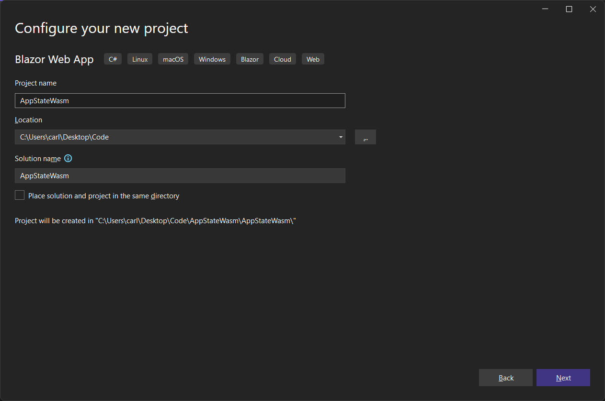
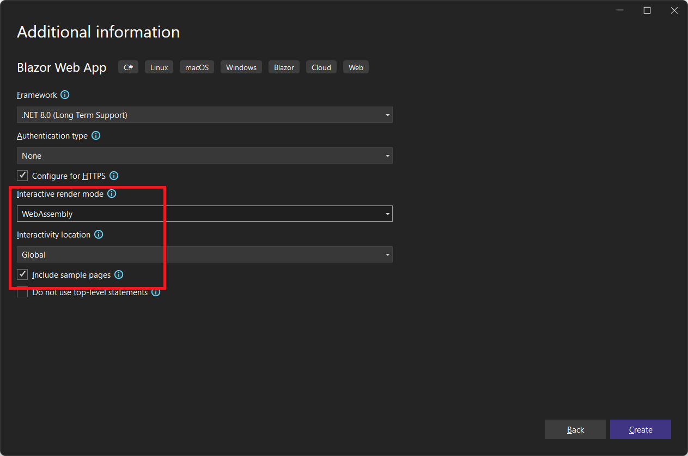
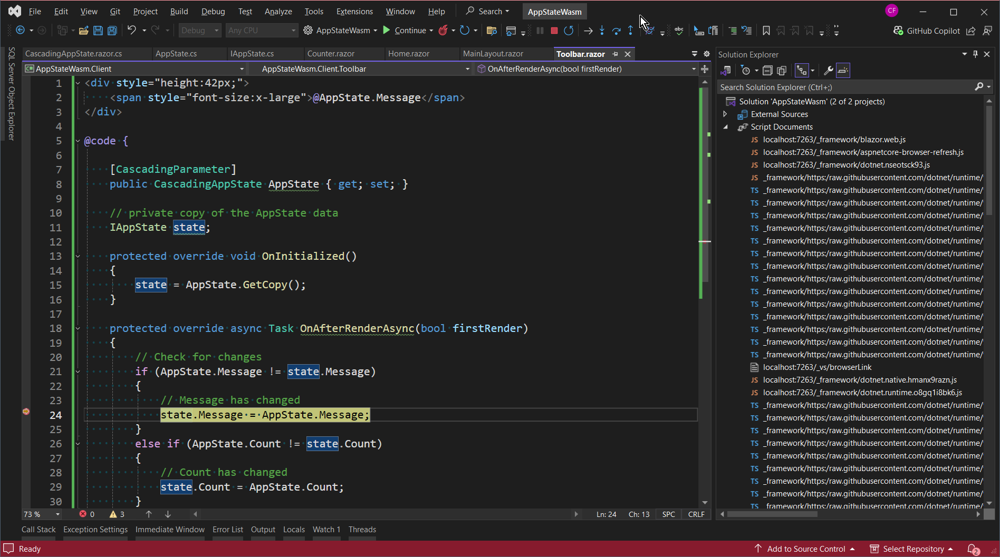
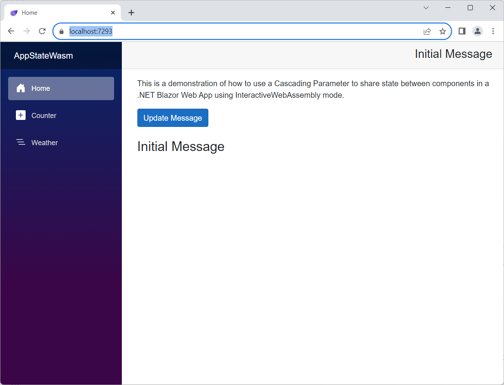

# Managing Application State in .NET 8/9 Blazor Web Apps

> This repo shows how to manage application state in a .NET 8 or .NET 9 Blazor Web App using Interactive WebAssembly RenderMode.
>
> See these other repos for demos using the other two render modes:
>
> - https://github.com/carlfranklin/AppStateServer (Server)
> - https://github.com/carlfranklin/AppStateAuto (Auto)
>
> Watch the [BlazorTrain](https://blazortrain.com/) YouTube video [here](https://youtu.be/6oTTPM76-s8)

### What is Application State?

Application State (or app state) represents collectively all of the variables (objects, lists, etc.) that you keep alive in your application while in use.  The default Blazor Sample App templates keep all variables in code blocks inside of pages. The problem with this approach is that those variables get reinitialized every time the page is navigated to or refreshed. 

The key to app state is to move it to a component that lives *outside* of the pages so that 

1. variables persist between navigations and page refreshes
2. variables can be shared by all pages and components

#### Goals of an AppState Component

1. We want UI to automatically update via binding whenever any of the properties update.
2. We may want to get control when the state gets mutated.

### Create a new Blazor Web App called AppStateWasm




Make sure you specify the following options:



> Interactive render mode: **WebAssembly**
>
> Interactivity Location: **Global**
>
> Include sample pages: **yes**

## Cascading Component

The approach we will take is to use a Cascading component. This is essentially an object reference that can be accessed by any component in the render tree below where it is defined. If we want all pages and components to have access to it, we can wrap it around the Router in *Routes.razor*, but I'm getting ahead of myself.

**Observe the default behavior**

Run the app (F5)

Go to the `Counter` page and increment the counter, now navigate to the `Home` page (*Home*) and back to `Counter`. Notice that the counter has been reset to zero!

This is because the counter value itself (currentCount) is defined within the page.

```c#
@page "/counter"

<PageTitle>Counter</PageTitle>

<h1>Counter</h1>

<p role="status">Current count: @currentCount</p>

<button class="btn btn-primary" @onclick="IncrementCount">Click me</button>

@code {
    private int currentCount = 0;

    private void IncrementCount()
    {
        currentCount++;
    }
}
```

Whenever you navigate to a page, it is reinitialized. All of the module-level variables (such as currentCount) get reset to default values.

Let's fix that on our way to provide state to the entire app.

#### Add a new Razor Component to the Client project called CascadingAppState.razor

```c#
<CascadingValue Value="this">
    @ChildContent
</CascadingValue>

@code {

    [Parameter]
    public RenderFragment ChildContent { get; set; }

    /// <summary>
    /// Implement property handlers like so
    /// </summary>
    private string message = "";
    public string Message
    {
        get => message;
        set
        {
            message = value;
            StateHasChanged();  // Optionally force a re-render
        }
    }

    private int count = 0;
    public int Count
    {
        get => count;
        set
        {
            count = value;
            StateHasChanged();
        }
    }

    protected override void OnInitialized()
    {
        Message = "Initial Message";
    }
}
```

#### What is a RenderFragment?

A `RenderFragment` represents a chunk of Razor markup that can then be rendered by the component.  Razor components can capture their child content as a `RenderFragment` and render that content as part of the component rendering. To capture child content, define a component parameter of type `RenderFragment` and name it `ChildContent`.

Using a RenderFragment named ChildContent tells the Blazor component engine that ChildContent is everything in the render tree below this component.

The property handlers must be explicit so that we can call `StateHasChanged()` when values are set. That tells the rendering engine that something has changed, and a redraw is necessary.

For more information on RenderFragments see https://learn.microsoft.com/en-us/aspnet/core/blazor/components/?view=aspnetcore-8.0#child-content-render-fragments:

#### Wrap the entire contents of Routes.razor in an instance of CascadingAppState

```xml
<CascadingAppState>
    <Router AppAssembly="@typeof(Program).Assembly">
        <Found Context="routeData">
            <RouteView RouteData="@routeData" DefaultLayout="@typeof(Layout.MainLayout)" />
            <FocusOnNavigate RouteData="@routeData" Selector="h1" />
        </Found>
    </Router>
</CascadingAppState>
```

#### Add a Razor Component to the Client called Toolbar.razor

```c#
<div style="height:42px;">
    <span style="font-size:x-large">@AppState.Message</span>
</div>

@code {

    [CascadingParameter]
    public CascadingAppState AppState { get; set; }
}
```

The Toolbar will go across the top of the page. 

Note that we grab the reference to `CascadingAppState` with the `[CascadingParameter]` attribute. It's almost the same as injection, except that it's optimized for use in Blazor components and pages.

Now we can refer to `AppState` and it's properties anywhere in the component. The values of those properties exist OUTSIDE the page, and will still be there if we reload the component.

#### Modify Layout\MainLayout.razor to show the Toolbar

```xml
@inherits LayoutComponentBase

<div class="page">
    <div class="sidebar">
        <NavMenu />
    </div>

    <main>
        <div class="top-row px-4">
            <Toolbar/>
        </div>

        <article class="content px-4">
            @Body
        </article>
    </main>
</div>

<div id="blazor-error-ui">
    An unhandled error has occurred.
    <a href="" class="reload">Reload</a>
    <a class="dismiss">🗙</a>
</div>
```

#### Modify Pages\Home.razor

```c#
@page "/"

<PageTitle>Home</PageTitle>

<p>
    This is a demonstration of how to use a Cascading Parameter to share state between components
    in a .NET Blazor Web App using InteractiveWebAssembly mode.
</p>

<button class="btn btn-primary" @onclick="UpdateMessageButtonClicked">Update Message</button>
<br />
<br />
<h3>@AppState.Message</h3>

@code
{
    [CascadingParameter]
    public CascadingAppState AppState { get; set; }

    void UpdateMessageButtonClicked()
    {
        AppState.Message = $"Message Updated At {DateTime.Now.ToLongTimeString()}";
    }
}
```

Again, we're grabbing that cascading reference to CascadingAppState. Now we have two components with access to it, and they can both get and set it's properties. 

#### Modify Pages\Counter.razor

```c#
@page "/counter"

<PageTitle>Counter</PageTitle>

<h1>Counter</h1>

<p role="status">Current count: @AppState.Count</p>

<button class="btn btn-primary" @onclick="IncrementCount">Click me</button>

@code {

    [CascadingParameter]
    public CascadingAppState AppState { get; set; }

    private void IncrementCount()
    {
        // This is the only place AppState.Count is incremented
        AppState.Count++;
    }
}
```

Here we have replaced currentCount with `AppState.Count`. 

Go to the `Counter` page, and click the button. Now navigate to the `Home` page and back to the `Counter` page.

Notice that our `counter` page remembers the value between navigations. That's because it is being stored in the `CascadingAppStateProvider`!

Click the **Update Message** button, and notice that the text in the Toolbar changes automatically.

## Getting control when an AppState variable is changed

So far we have handled the situation where multiple components that access AppState properties can update their UI whenever one of those components changes an AppState property value.

What if a component needs to take action when a property value changes? For example, the Toolbar might want to send a message, make an API call, or the like. 

One option is just to handle this inside the *CascadingAppState.razor* component's property setters. However, we may not want to give the AppState component such power over the application. In general, we should adhere to the [Single Responsibility Principle](https://learn.microsoft.com/en-us/dotnet/architecture/modern-web-apps-azure/architectural-principles).

In previous versions of this code, I created a pub/sub mechanism by which each component/page can be notified when a property changes. 

This demo turned out to have memory leaks, because I didn't provide a way to unsubscribe (UnRegister). One fix would be to implement *IDisposable* to unhook the event callback. It works fine, but I wanted an easier solution that didn't require un-registering.

So, on January 17. 2025, I greatly simplified this process. CascadingAppState.GetCopy() returns a copy of all the properties via an Interface. Any component can determine what changed by hooking OnAfterRender and comparing the AppState values to the saved values.

### Monitor AppState Property Changes in the Toolbar

First, we are going to separate the properties we want to persist into an interface.

That will allow us to serialize just those properties to JSON, allowing us to make a deep copy, and also persist the values, which we will do in a few minutes.

Add the following class to the client project:

*IAppState.cs*

```c#
namespace AppStateWasm.Client;

public interface IAppState
{
    string Message { get; set; }
    int Count { get; set; }
}
```

`System.Text.Json` will not deserialize to an interface, so we have to create a class that implements the interface:

*AppState.cs*

```c#
namespace AppStateWasm.Client;

public class AppState : IAppState
{
    public string Message { get; set; } =  string.Empty;
    public int Count { get; set; }
}
```

Now replace *CascadingAppState.razor* with the following:

```c#
<CascadingValue Value="this">
    @ChildContent
</CascadingValue>
```

Add a code-behind file named *CascadingAppState.razor.cs*:

```c#
using Microsoft.AspNetCore.Components;
using System.Text.Json;

namespace AppStateWasm.Client;

public partial class CascadingAppState: ComponentBase, IAppState
{
	[Parameter]
	public RenderFragment ChildContent { get; set; }

	// Used for tracking changes
	public IAppState GetCopy()
	{
		var state = (IAppState)this;
		var json = JsonSerializer.Serialize(state);
		var copy = JsonSerializer.Deserialize<AppState>(json);
		return copy;
	}

	/// <summary>
	/// Implement property handlers like so
	/// </summary>
	private string message = "";
	public string Message
	{
		get => message;
		set
		{
			message = value;
			// Force a re-render
			StateHasChanged();
		}
	}

	private int count = 0;
	public int Count
	{
		get => count;
		set
		{
			count = value;
			StateHasChanged();
		}
	}

	protected override void OnInitialized()
	{
		Message = "Initial Message";
	}
}
```

The `GetCopy()` method will return a copy of all the values that we are interested in monitoring.

Replace *Toolbar.razor* with this:

```c#
<div style="height:42px;">
    <span style="font-size:x-large">@AppState.Message</span>
</div>

@code {

    [CascadingParameter]
    public CascadingAppState AppState { get; set; }

    // private copy of the AppState data
    IAppState state;

    protected override void OnInitialized()
    {
        state = AppState.GetCopy();
    }

    protected override async Task OnAfterRenderAsync(bool firstRender)
    {
        // Check for changes
        if (AppState.Message != state.Message)
        {
            // Message has changed
            state.Message = AppState.Message;
        }
        else if (AppState.Count != state.Count)
        {
            // Count has changed
            state.Count = AppState.Count;
        }
    }
}
```

When a property is changed, a render happens. Your component can test to see what values have changed by comparing them against the saved state variable.

Set a breakpoint on this line:

```c#
// Message has changed
state.Message = AppState.Message;
```

Run the app and click the **Update Message** button.




There it is.  A simple solution to monitoring AppState values.

### Monitoring State Changes from Non-UI Components

There is a use-case for having a component with no user interface instantiated on a page, and that component needs to be notified of changes to AppState properties. For example, a component that provides access to back-end services via API or other mechanisms. Wrapping that code in a component gives you access to cascading parameters, event callbacks, and other features.

The good news is that as long as the component is instantiated on a page, the OnAfterRender method will be called, even though there is no UI.

To demonstrate this, add a new Razor component to the client project that has no UI, but handles changes the way we just did in the toolbar:

*HiddenComponent.razor*:

```c#
@code {

    [CascadingParameter]
    public CascadingAppState AppState { get; set; }

    // private copy of the AppState data
    IAppState state;

    protected override void OnInitialized()
    {
        state = AppState.GetCopy();
    }

    protected override async Task OnAfterRenderAsync(bool firstRender)
    {
        // Check for changes
        if (AppState.Message != state.Message)
        {
            // Message has changed
            state.Message = AppState.Message;
        }
        else if (AppState.Count != state.Count)
        {
            // Count has changed
            state.Count = AppState.Count;
        }
    }

}
```

Now, create an instance in *Home.razor* at the bottom of the markup:

```xml
<HiddenComponent />
```

Put a breakpoint on the line:

```c#
// Message has changed
state.Message = AppState.Message;
```

Run the app and press the button. The code breaks as expected.

Now, try putting a breakpoint on this line:

```c#
// Count has changed
state.Count = AppState.Count;
```

Go to the Counter page and increment the count. The breakpoint does not hit because our `HiddenComponent` is not in play. It's not instantiated on the Counter page. 

Here's the bottom line: if you need to get control whenever a state property changes in any page, that component needs to be visible. Consider moving it to a place that's always visible like a toolbar, a sidebar, or a footer.

### Alternative: Use a Standard C# Action

OK, I hear you. You'd rather just use the standard method, which requires subscribing and unsubscribing from events. Here's what you need to do.

Add the following to *CascadingAppState.razor.cs*:

```c#
// Alternative property change notification event
public event Action<string> PropertyChanged;
private void NotifyPropertyChanged(string value) => PropertyChanged?.Invoke(value);
```

In the property setters, after calling `StateHasChanged()`, make the following call:

```c#
NotifyPropertyChanged("Message");
```

Of course, "Message" is the name of the property that has changed.

Now, in the components that will consume the event, you'll need to implement `IDisposable`:

```
@implements IDisposable
```

Create an event handler:

```c#
public void PropertyChangedHandler(string PropertyName)
{
    // take action based on the property name
}
```

To Subscribe:

```c#
protected override void OnInitialized()
{
    AppState.PropertyChanged += PropertyChangedHandler;
}
```

To Unsubscribe:

```c#
public void Dispose()
{
    AppState.PropertyChanged -= PropertyChangedHandler;
}
```

Check out *Toolbar.razor* in the repo for a complete demo.

## Persisting Application State

It would be great if we could save certain `AppState` properties so that they will come back the next time the app is run. 

Here's a scenario: You have a large set of input form fields that the user needs to fill out. After meticulously entering 99% of their data, they have to take a phone call during which the form times out, the computer reboots, or some other issue forces them to refresh the page. All that work is for nothing. 

By keeping their form values in AppState properties, and persisting those properties to their local storage area in their browser, we can retrieve the values the next time they log in. 

What's more, we can keep track of other data such as what page they were using, or any other session-scoped variables that we'd like to persist between sessions.

In this example, we will also implement a time window, after which we will NOT reload their AppState property values. Another option would be to ask the user if they'd like to continue where they left off whenever they log in. 

We will need access to LocalStorage. For this we will use Chris Sainty's `Blazored.LocalStorage` pagckage.

Add the following package reference to both the server and client projects:

```
Install-Package Blazored.LocalStorage
```

or

```xml
<PackageReference Include="Blazored.LocalStorage" Version="4.5.0" />
```

Add this to *Program.cs* in both projects:

```c#
builder.Services.AddBlazoredLocalStorage();
```

You'll need this:

```c#
using Blazored.LocalStorage;
```

We need to add a field to our `IAppState` interface and implementation:

*IAppState.cs*

```c#
namespace AppStateWasm.Client;

public interface IAppState
{
    string Message { get; set; }
    int Count { get; set; }
    DateTime LastStorageSaveTime { get; set; }
}
```

```c#
namespace AppStateWasm.Client;

public class AppState : IAppState
{
    public string Message { get; set; } =  string.Empty;
    public int Count { get; set; }
    public DateTime LastStorageSaveTime { get; set; }
}
```

Replace *CascadingAppState.razor.cs* with this:

```c#
using Microsoft.AspNetCore.Components;
using Blazored.LocalStorage;
using System.Text.Json;

namespace AppStateWasm.Client;

public partial class CascadingAppState : ComponentBase, IAppState
{
    private readonly string StorageKey = "MyAppStateKey";

    private readonly int StorageTimeoutInSeconds = 30;

    bool loaded = false;

    public DateTime LastStorageSaveTime { get; set; }

    [Inject]
    ILocalStorageService localStorage { get; set; }

    [Parameter]
    public RenderFragment ChildContent { get; set; }
    
	// Used for tracking changes
	public IAppState GetCopy()
	{
		var state = (IAppState)this;
		var json = JsonSerializer.Serialize(state);
		var copy = JsonSerializer.Deserialize<AppState>(json);
		return copy;
	}

    /// <summary>
    /// Implement property handlers like so
    /// </summary>
    private string message = "";
    public string Message
    {
        get => message;
        set
        {
            message = value;
            // Force a re-render
            StateHasChanged();
            // Save to local storage
            new Task(async () =>
            {
                await Save();
            }).Start();
        }
    }

    private int count = 0;
    public int Count
    {
        get => count;
        set
        {
            count = value;
            StateHasChanged();
            new Task(async () =>
            {
                await Save();
            }).Start();
        }
    }

    protected override async Task OnAfterRenderAsync(bool firstRender)
    {
        if (firstRender)
        {
            await Load();
            loaded = true;
            StateHasChanged();
        }
    }

    protected override void OnInitialized()
    {
        Message = "Initial Message";
    }

    public async Task Save()
    {
        if (!loaded) return;

        // set LastSaveTime
        LastStorageSaveTime = DateTime.Now;
        // serialize 
        var state = (IAppState)this;
        // save
        await localStorage.SetItemAsync<IAppState>(StorageKey, state);
    }

    public async Task Load()
    {
        try
        {
            var json = await localStorage.GetItemAsStringAsync(StorageKey);
            if (json == null || json.Length == 0) return;
            var state = JsonSerializer.Deserialize<AppState>(json);
            if (state != null)
            {
                if (DateTime.Now.Subtract(state.LastStorageSaveTime).TotalSeconds <= StorageTimeoutInSeconds)
                {
                    // decide whether to set properties manually or with reflection

                    // comment to set properties manually
                    //this.Message = state.Message;
                    //this.Count = state.Count;

                    // set properties using Reflection
                    var t = typeof(IAppState);
                    var props = t.GetProperties();
                    foreach (var prop in props)
                    {
                        if (prop.Name != "LastStorageSaveTime")
                        {
                            object value = prop.GetValue(state);
                            prop.SetValue(this, value, null);
                        }
                    }

                }
            }
        }
        catch (Exception ex)
        {

        }
    }
}
```

Notice that we are implementing `IAppState`  so we can easily serialize and deserialize just those properties.

Check out `Save()`:

```c#
    public async Task Save()
    {
        if (!loaded) return;

        // set LastSaveTime
        LastStorageSaveTime = DateTime.Now;
        // serialize 
        var state = (IAppState)this;
        // save
        await localStorage.SetItemAsync<IAppState>(StorageKey, state);
    }
```

This gets called from our property setters. 

Any time a property is changed, all the values of all the properties in `IAppState` will be saved in local storage.

> ***NOTE***: Everything still works as before, but now we can persist all the properties exposed by the Interface.

Now check out  `Load()`, which is called from`OnAfterRenderAsync` :

```c#
public async Task Load()
{
    try
    {
        var json = await localStorage.GetItemAsStringAsync(StorageKey);
        if (json == null || json.Length == 0) return;
        var state = JsonSerializer.Deserialize<AppState>(json);
        if (state != null)
        {
            if (DateTime.Now.Subtract(state.LastStorageSaveTime).TotalSeconds <= StorageTimeoutInSeconds)
            {
                // decide whether to set properties manually or with reflection

                // comment to set properties manually
                //this.Message = state.Message;
                //this.Count = state.Count;

                // set properties using Reflection
                var t = typeof(IAppState);
                var props = t.GetProperties();
                foreach (var prop in props)
                {
                    if (prop.Name != "LastStorageSaveTime")
                    {
                        object value = prop.GetValue(state);
                        prop.SetValue(this, value, null);
                    }
                }

            }
        }
    }
    catch (Exception ex)
    {

    }
}
```

This happens after the first render.

We're reading the JSON from local storage, deserializing it into an `AppState` object (remember, we can't serialize to an interface), and then using reflection to set the values that are part of our interface.

Press F5 and press the **Update Message** button. You can also update the counter if you like.


Close the app right after making a change, and then run it again within 30 seconds. The AppState will load from LocalStorage:


If you close the app and wait at least 30 seconds before running it again, the AppState gets reset and you're back to square one.



### Only Persist Certain Properties

The `IAppStae` interface and the `AppState` class determine which properties get persisted, and you can modify them at will. The only requirement is that the properties must be implemented in *CascadingAppState.razor*.

Try it! Remove a property from both `IAppState` and `AppState`. Run the app and test the persistence.

